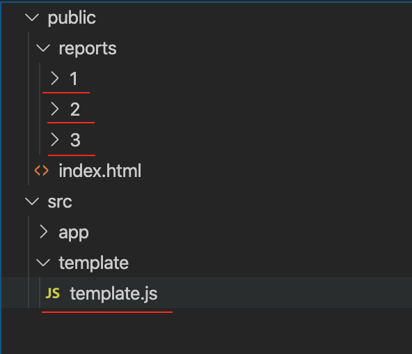
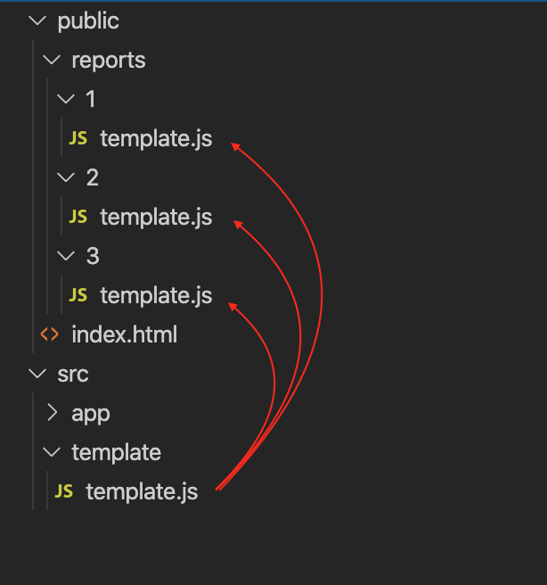

# gatsby-plugin-copy-files-enhanced  [](https://npmjs.com/package/gatsby-plugin-copy-files-enhanced)  [](https://npmjs.com/package/gatsby-plugin-copy-files-enhanced)

You can use this plugin to copy files in your Gatsby project. Specify absolute `source` path and relative `destination` path using plugin options.

#### What's different from `gatsby-plugin-copy-files`

- In `gatsby-plugin-copy-files` you should specify destination and you have no option to copy to multiple direcotries **in one go**. `gatsby-plugin-copy-files-enhanced` enables you to wildcard your destination, so that you can easily copy files.

- This plugin has option to **overwrite** your destination direcotry simply using `purge` plugin option.


#### Plugin options

| Option    | Description |
|:----------|:---------|
|`source`     |Absolute path of the source (eg: `${__dirname}/path`)|
|`destination`|Relative path to destination within `public/` direcotry </br> You can add `/*/` inside destination path to wildcard destination lookup </br> *Refer to [graphical explanation](#graphical-explanation) for better understanding*
|`purge`      |Overwrite destination. `false` by default|

#### Important
This plugin should be used with `gatsby-source-filesystem`

#### Eample
``` js
{
    resolve: 'gatsby-plugin-copy-files-enhanced',
    options: {
        source: `${__dirname}/src/reportTemplate` ,
        destination: '/reports/*/',
        purge: true,
    }
}, {
    resolve: 'gatsby-plugin-copy-files-enhanced',
    options: {
        source: `${__dirname}/src/images` ,
        destination: '/containers/*/images',
        purge: false,
    }
}
```

#### Graphical explanation

Let's consider that you have a `template.js` file that you need to copy to all reports within `public/reports/` direcotry and you are not sure of report names and how many would be there.





In such case you can wildcard the destination path so that you can easily copy `template.js` to all direcotries with `public/reports/`




##### Simply use this code to get this done
``` js
{
    resolve: 'gatsby-plugin-copy-files-enhanced',
    options: {
        source: `${__dirname}/src/template/` ,
        destination: '/reports/*/',
        purge: true,
    }
}
```

<i>Inspired by `gatsby-plugin-copy-files` </i> <3

